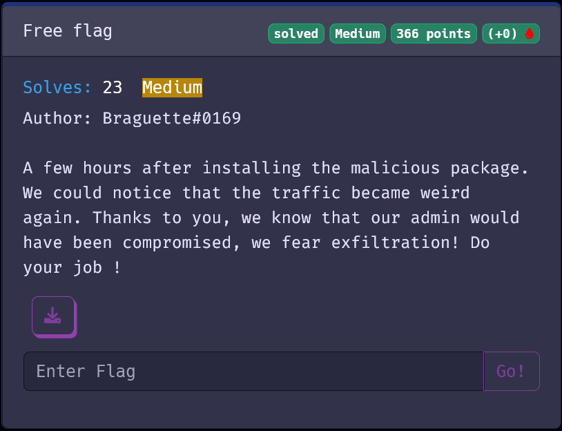
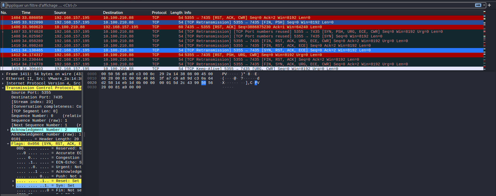
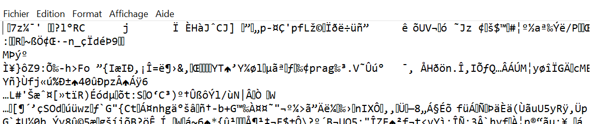
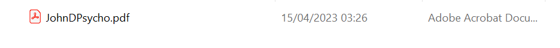

# free flag



[challenge file](./ez.pcap)

## Searching the data breach

When analysing the pcap file with wireshark, it appears that there are strange packets.



This packets contain unusuall tcp flags. By looking more into tcp flags, we can see that there are made of 8 bits, which is perfect to store a character.

We can also see that the ip receiving the strange packets is the same, 10.100.210.88.

Let's do a script to retreive the data that is send.

## data retreiving

To do that, I'll use python with the module pyshark.

```py
import pyshark
import os

os.chdir(os.path.dirname(__file__))

file = pyshark.FileCapture("ez.pcap")

total = bytes()

for packet in file:
    if "tcp" in dir(packet):
        if packet['ip'].dst == "10.100.210.88":
            ad = eval(f"0x{packet.tcp.flags[4:6]}").to_bytes()
            total += ad

print(total)

with open("res.txt", 'wb') as f:
    f.write(total)
```

We can see that the file we just created is not plain text.



But the file starts with 7z, so by changing the extension to `.7z` and unpacking it, we obtain a directory.



And in the pdf, we can read the flag.


The flag is `PWNME{1s_j0hN_D_R34l}`.

Thanks for the challenge.