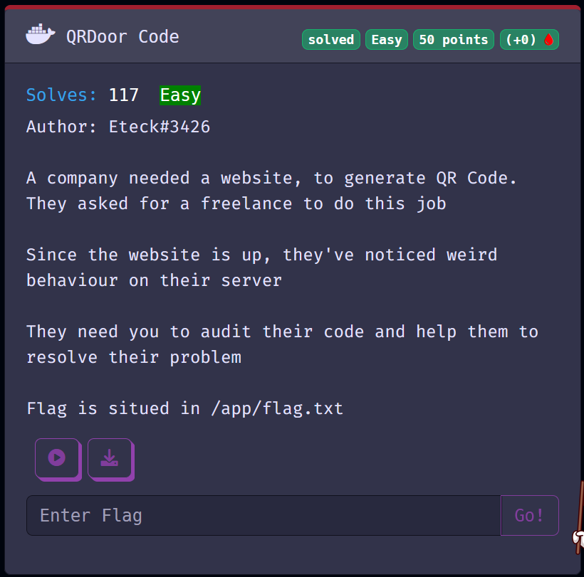
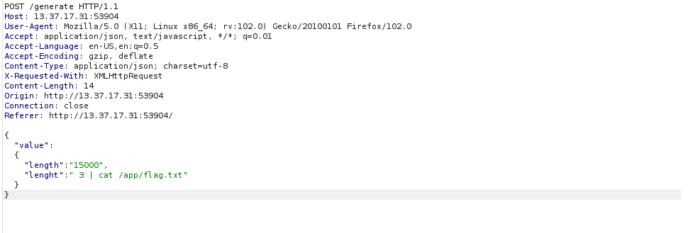
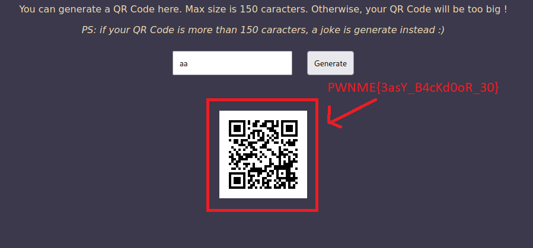

# QrDoor




This challenge was made of a webiste, made in nodejs.

```js
const cookieParser = require('cookie-parser')
const express = require('express')
const { exec } = require("child_process");
const qrcode = require('qrcode');

const PORT = process.env.PORT || 4560;

const app = express();
app.set('view engine', 'ejs');
app.use(express.json());
app.use(cookieParser());

class QRCode {
    constructor(value, defaultLength){
        this.value = value
        this.defaultLength = defaultLength
    }

    async getImage(){
        if(!this.value){
            // Use 'fortune' to generate a random funny line, based on the input size
            try {
                this.value = await execFortune(this.defaultLength)
            } catch (error) {
                this.value = 'Error while getting a funny line'
            }
        }
        return await qrcode.toDataURL(this.value).catch(err => 'error:(')
    }
}

app.get('/', async (req, res) => {
    res.render('index');
});

app.post('/generate', async (req, res) => {
    const { value } = req.body;
    try {
        let newQrCode;
        // If the length is too long, we use a default according to the length
        if (value.length > 150)
            newQrCode = new QRCode(null, value.lenght)
        else {
            newQrCode = new QRCode(String(value))
        }
        
        const code = await newQrCode.getImage()
        res.json({ code, data: newQrCode.value });
    } catch (error) {
        res.status(422).json({ message: "error", reason: 'Unknow error' });
    }
});

function execFortune(defaultLength) {
    return new Promise((resolve, reject) => {
     exec(`fortune -n ${defaultLength}`, (error, stdout, stderr) => {
      if (error) {
        reject(error);
      }
      resolve(stdout? stdout : stderr);
     });
    });
   }

app.listen(PORT, async () => {
    console.log(`QR Code Generator is running on port ${PORT}`);
});
```

If look closely at the source code, we can see a programming mistake here
```js
app.post('/generate', async (req, res) => {
    const { value } = req.body;
    try {
        let newQrCode;
        // If the length is too long, we use a default according to the length
        if (value.length > 150)
            newQrCode = new QRCode(null, value.lenght)
        else {
            newQrCode = new QRCode(String(value))
        }
        
        const code = await newQrCode.getImage()
        res.json({ code, data: newQrCode.value });
    } catch (error) {
        res.status(422).json({ message: "error", reason: 'Unknow error' });
    }
});
```
In the first `new QRCode`, the argument used is value.lenght (the real one is value.length). So by injecting json it's possible to manipulate them.

To sum up what the app does, when length is under 150, it generates a qr code with the content, whereas when length is more than 150, it executes in a shell `fortune -n ${value.lenght}` (with the wrong spelling).

So, we only need to inject a json called value, with `length > 150` and `lenght = 1 | shell_comand`.




This payload gives




And here we have the flag PWNME{3asY_B4cKd0oR_30}.

Thanks for the challenge!!